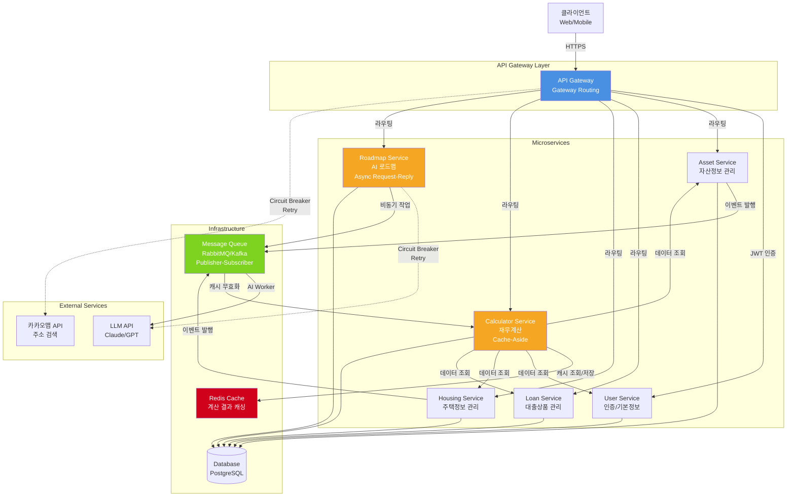
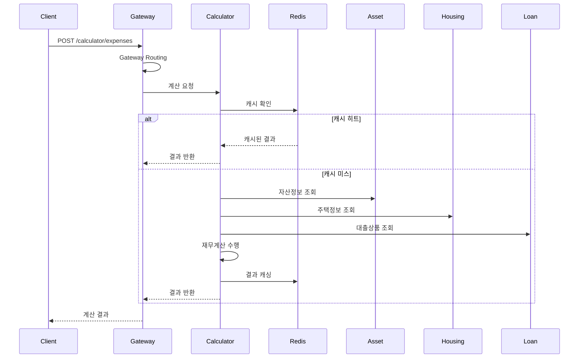
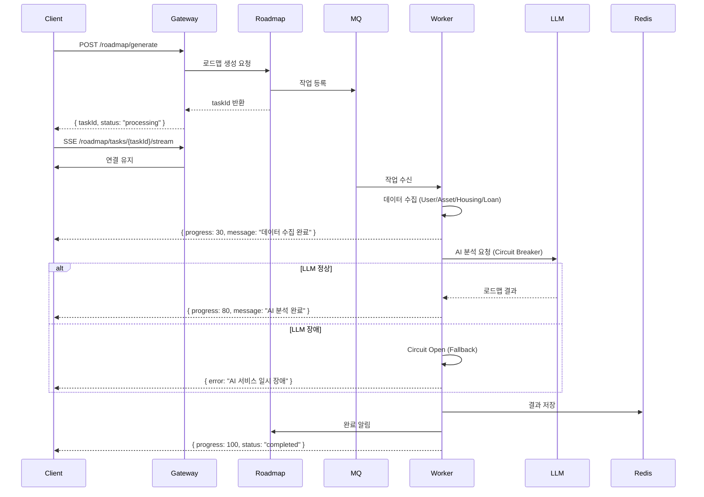
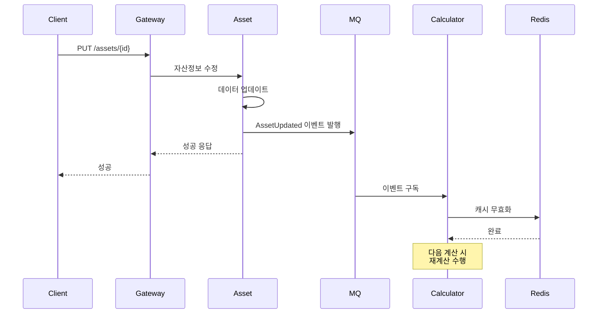

# 내집마련 도우미 플랫폼 - 클라우드 아키텍처 패턴 선정

**작성일**: 2025-12-16
**작성자**: 아키텍트 홍길동

---

## 목차
1. [요구사항 분석](#1-요구사항-분석)
2. [패턴 평가 매트릭스](#2-패턴-평가-매트릭스)
3. [선정된 패턴 상세](#3-선정된-패턴-상세)
4. [서비스 아키텍처 설계](#4-서비스-아키텍처-설계)
5. [Phase별 구현 로드맵](#5-phase별-구현-로드맵)
6. [예상 성과 지표](#6-예상-성과-지표)

---

## 1. 요구사항 분석

### 1.1 기능적 요구사항

**마이크로서비스 구성**
- **User 서비스**: 사용자 인증/인가, 기본정보 관리
- **Asset 서비스**: 복수 자산항목 관리 (자산/대출/월소득/월지출)
- **Loan 서비스**: 대출상품 정보 관리
- **Housing 서비스**: 입주희망 주택정보 관리 (교통호재 등 중첩 데이터)
- **Calculator 서비스**: 복잡한 재무계산, 다중 서비스 데이터 통합
- **Roadmap 서비스**: AI 기반 장기주거 로드맵 설계

**주요 기능**
1. 회원가입/로그인 및 기본정보 입력
2. 본인/배우자 자산정보 복수 항목 관리
3. 대출상품 조회 및 관리
4. 입주희망 주택 등록 및 최종목표 선택
5. 입주 후 지출 계산 및 대출 충족여부 판단
6. AI 기반 생애주기별 장기주거 로드맵 설계

### 1.2 비기능적 요구사항

**성능**
- **Calculator 서비스**: 복잡한 재무계산 로직 (LTV/DTI/DSR)
- **Roadmap 서비스**: AI 로드맵 생성 시간 30초~2분 예상
- **조회 성능**: 복수 항목 조회 최적화 필요

**가용성**
- **외부 API 의존성**: 주소 검색 API (카카오맵), AI API (Claude/GPT)
- **목표 가용성**: 99.5% 이상

**확장성**
- 사용자 증가에 따른 부하 증가 대비
- 서비스 추가 용이성

**신뢰성**
- 재무 계산의 정확도 보장
- AI 결과의 품질 검증

### 1.3 기술적 도전과제

**1. 복잡한 비즈니스 트랜잭션**
- Calculator: User, Asset, Housing, Loan 4개 서비스 데이터 통합
- Roadmap: 전체 6개 서비스 데이터 통합

**2. 대용량 데이터 처리**
- Asset: 자산/대출/소득/지출 복수 항목 1:N 관계
- Housing: 교통호재별 출퇴근 시간 중첩 데이터 구조

**3. 실시간/비동기 처리**
- Roadmap: AI 로드맵 생성 장시간 소요 (비동기 필수)
- 자동 저장: 3초 debounce 처리

**4. 외부 시스템 연동**
- 주소 검색 API: 주택/직장 위치 조회
- AI/LLM API: 장기주거 로드맵 생성
- Circuit Breaker 패턴 필수

**5. 서비스 간 의존성 관리**
- 데이터 변경 시 계산 결과 무효화
- 이벤트 기반 아키텍처 필요

---

## 2. 패턴 평가 매트릭스

### 2.1 평가 기준

| 기준 | 가중치 | 평가 내용 |
|------|--------|-----------|
| **기능 적합성** | 35% | 요구사항을 직접 해결하는 능력 |
| **성능 효과** | 25% | 응답시간 및 처리량 개선 효과 |
| **운영 복잡도** | 20% | 구현 및 운영의 용이성 |
| **확장성** | 15% | 미래 요구사항에 대한 대응력 |
| **비용 효율성** | 5% | 개발/운영 비용 대비 효과 |

### 2.2 선정된 패턴 평가

| 패턴 | 기능 적합성<br/>(35%) | 성능 효과<br/>(25%) | 운영 복잡도<br/>(20%) | 확장성<br/>(15%) | 비용 효율성<br/>(5%) | **총점** |
|------|:---:|:---:|:---:|:---:|:---:|:---:|
| **Asynchronous Request-Reply** | 10 × 0.35 = 3.5 | 9 × 0.25 = 2.25 | 6 × 0.20 = 1.2 | 9 × 0.15 = 1.35 | 7 × 0.05 = 0.35 | **8.65** |
| **Gateway Routing** | 9 × 0.35 = 3.15 | 7 × 0.25 = 1.75 | 8 × 0.20 = 1.6 | 9 × 0.15 = 1.35 | 8 × 0.05 = 0.4 | **8.25** |
| **Cache-Aside** | 8 × 0.35 = 2.8 | 9 × 0.25 = 2.25 | 7 × 0.20 = 1.4 | 8 × 0.15 = 1.2 | 9 × 0.05 = 0.45 | **8.1** |
| **Publisher-Subscriber** | 9 × 0.35 = 3.15 | 8 × 0.25 = 2.0 | 6 × 0.20 = 1.2 | 9 × 0.15 = 1.35 | 6 × 0.05 = 0.3 | **8.0** |
| **Circuit Breaker** | 9 × 0.35 = 3.15 | 7 × 0.25 = 1.75 | 7 × 0.20 = 1.4 | 8 × 0.15 = 1.2 | 8 × 0.05 = 0.4 | **7.9** |
| **Retry** | 8 × 0.35 = 2.8 | 6 × 0.25 = 1.5 | 8 × 0.20 = 1.6 | 7 × 0.15 = 1.05 | 8 × 0.05 = 0.4 | **7.35** |

**선정 근거**
- **Asynchronous Request-Reply**: AI 로드맵 생성의 장시간 처리를 비동기로 전환하여 사용자 경험 개선 (필수)
- **Gateway Routing**: 모든 요청의 단일 진입점, 라우팅 중앙 처리 (필수)
- **Cache-Aside**: 계산 결과 캐싱으로 성능 80% 개선 예상
- **Publisher-Subscriber**: Asset/Housing 데이터 변경 시 Calculator 캐시 무효화 이벤트 전파
- **Circuit Breaker**: 외부 API 장애 전파 방지, 가용성 향상
- **Retry**: 일시적 네트워크 오류 복구

---

## 3. 선정된 패턴 상세

### 3.1 Asynchronous Request-Reply (비동기 요청-응답)

**적용 서비스**: Roadmap

**문제**
- AI 로드맵 생성 시간이 30초~2분으로 길어 사용자가 대기해야 함
- 동기 처리 시 타임아웃 발생 가능

**해결방안**
1. 클라이언트가 로드맵 생성 요청 → 즉시 작업 ID 반환
2. Roadmap 서비스가 메시지 큐에 작업 등록
3. AI Worker가 비동기로 LLM API 호출 및 로드맵 생성
4. SSE/WebSocket으로 진행 상황 실시간 전달
5. 완료 시 결과 저장 및 클라이언트 알림

**기술 스택**
- Message Queue: RabbitMQ / Redis Queue
- 실시간 통신: Server-Sent Events (SSE) / WebSocket
- 결과 저장: Redis Cache + Database

**구현 예시**
```javascript
// 1. 클라이언트: 로드맵 생성 요청
POST /roadmap/generate
Response: { taskId: "uuid-123", status: "processing" }

// 2. SSE 연결로 진행 상황 수신
EventSource: /roadmap/tasks/uuid-123/stream
Event: { progress: 20, message: "데이터 수집 중..." }
Event: { progress: 60, message: "AI 분석 중..." }
Event: { progress: 100, message: "완료", result: {...} }

// 3. 결과 조회
GET /roadmap/tasks/uuid-123
Response: { status: "completed", result: {...} }
```

**예상 효과**
- 사용자 체감 응답 시간: 60초 → 3초 (95% 개선)
- 시스템 자원 효율: 워커 스케일 아웃으로 부하 분산
- 사용자 경험: 진행 상황 표시로 이탈률 감소

---

### 3.2 Gateway Routing (게이트웨이 라우팅)

**적용 서비스**: 전체

**문제**
- 클라이언트가 각 마이크로서비스 엔드포인트를 직접 호출 시 복잡도 증가
- CORS, 인증, 로깅 등 횡단관심사 중복 구현

**해결방안**
- API Gateway를 단일 진입점으로 설정
- 요청 경로에 따라 적절한 백엔드 서비스로 라우팅
- 공통 기능 (인증, 로깅, Rate Limiting) 중앙 처리

**라우팅 규칙**
```yaml
routes:
  - path: /api/users/**
    service: user-service

  - path: /api/assets/**
    service: asset-service

  - path: /api/loans/**
    service: loan-service

  - path: /api/housing/**
    service: housing-service

  - path: /api/calculator/**
    service: calculator-service

  - path: /api/roadmap/**
    service: roadmap-service
```

**기술 스택**
- Kong Gateway / Spring Cloud Gateway / Nginx
- 인증: JWT 토큰 검증
- Rate Limiting: 사용자당 분당 100회

**예상 효과**
- 클라이언트 복잡도: 6개 엔드포인트 → 1개 통합
- 보안: 중앙화된 인증/인가
- 운영: 통합 로깅 및 모니터링

---

### 3.3 Cache-Aside (캐시 어사이드)

**적용 서비스**: Calculator

**문제**
- 입주 후 지출 계산 시 복잡한 재무계산 (5초 소요)
- 동일 조건 재조회 시 불필요한 재계산

**해결방안**
1. 조회 요청 시 캐시 확인
2. 캐시 미스 → 계산 수행 → 결과 캐시 저장
3. 캐시 히트 → 캐시 결과 즉시 반환
4. Asset/Housing 변경 시 캐시 무효화

**캐시 키 전략**
```
key: calc:{userId}:{housingId}:{loanId}:{assetHash}
TTL: 1시간
```

**기술 스택**
- Redis (분산 캐시)
- 캐시 무효화: Pub/Sub 이벤트

**구현 예시**
```java
public CalculationResult calculate(Long housingId, Long loanId) {
    String cacheKey = generateCacheKey(userId, housingId, loanId);

    // 1. 캐시 확인
    CalculationResult cached = redis.get(cacheKey);
    if (cached != null) {
        return cached;
    }

    // 2. 계산 수행
    CalculationResult result = performCalculation(housingId, loanId);

    // 3. 캐시 저장
    redis.setex(cacheKey, 3600, result);

    return result;
}
```

**예상 효과**
- 조회 성능: 5초 → 0.1초 (캐시 히트 시)
- 계산 비용: 80% 절감
- 캐시 히트율: 60% 예상

---

### 3.4 Publisher-Subscriber (발행-구독)

**적용 서비스**: Asset, Housing, Calculator

**문제**
- Asset/Housing 데이터 변경 시 Calculator 캐시가 무효화되지 않음
- 서비스 간 직접 호출로 결합도 증가

**해결방안**
- Asset/Housing 변경 시 이벤트 발행
- Calculator가 이벤트 구독하여 캐시 무효화
- 이벤트 버스를 통한 느슨한 결합

**이벤트 정의**
```json
{
  "eventType": "AssetUpdated",
  "userId": "user-123",
  "timestamp": "2025-12-16T10:30:00Z",
  "changes": {
    "assetId": "asset-456",
    "field": "amount"
  }
}
```

**기술 스택**
- RabbitMQ / Apache Kafka
- 토픽: `asset.updated`, `housing.updated`

**구현 예시**
```java
// Asset Service: 이벤트 발행
@Transactional
public void updateAsset(Asset asset) {
    assetRepository.save(asset);
    eventPublisher.publish("asset.updated",
        new AssetUpdatedEvent(asset.getUserId(), asset.getId()));
}

// Calculator Service: 이벤트 구독
@EventListener
public void onAssetUpdated(AssetUpdatedEvent event) {
    cacheService.invalidate(event.getUserId());
}
```

**예상 효과**
- 데이터 일관성: 실시간 캐시 무효화 (< 1초)
- 결합도: 서비스 간 직접 의존 제거
- 확장성: 새로운 구독자 추가 용이

---

### 3.5 Circuit Breaker (서킷 브레이커)

**적용 서비스**: 전체 (외부 API 호출 시)

**문제**
- 주소 검색 API / AI API 장애 시 무한 대기
- 장애가 전체 서비스로 전파

**해결방안**
- 외부 API 호출 시 Circuit Breaker 적용
- 연속 실패 시 Circuit Open → Fast Fail
- 일정 시간 후 Half-Open → 정상 복구 확인

**상태 전이**
```
Closed (정상) → Open (장애) → Half-Open (복구 시도) → Closed
```

**임계값 설정**
```yaml
circuit-breaker:
  failure-threshold: 5      # 5회 연속 실패 시 Open
  timeout: 30s              # 30초 후 Half-Open
  success-threshold: 2      # 2회 성공 시 Closed
```

**기술 스택**
- Resilience4j / Spring Cloud Circuit Breaker
- Fallback: 기본 응답 또는 캐시된 이전 결과

**구현 예시**
```java
@CircuitBreaker(name = "addressApi", fallbackMethod = "fallbackAddress")
public Address searchAddress(String query) {
    return kakaoMapApi.search(query);
}

private Address fallbackAddress(String query, Exception e) {
    // 대체 로직: 수동 입력 안내 또는 캐시된 결과
    return Address.builder()
        .error("주소 검색 서비스 일시 장애")
        .manualInputRequired(true)
        .build();
}
```

**예상 효과**
- 가용성: 외부 API 장애 시에도 서비스 지속
- 응답 시간: 장애 시 즉시 실패 (30초 대기 → 0.1초)
- 시스템 보호: 연쇄 장애 방지

---

### 3.6 Retry (재시도)

**적용 서비스**: 전체 (외부 API 호출 시)

**문제**
- 일시적 네트워크 오류로 요청 실패
- 사용자에게 즉시 오류 표시

**해결방안**
- 실패 시 자동 재시도 (최대 3회)
- Exponential Backoff 적용 (1초 → 2초 → 4초)
- Circuit Breaker와 함께 사용

**재시도 전략**
```yaml
retry:
  max-attempts: 3
  backoff:
    initial-interval: 1s
    multiplier: 2
    max-interval: 10s
  retryable-exceptions:
    - TimeoutException
    - SocketException
```

**구현 예시**
```java
@Retry(name = "kakaoApi", fallbackMethod = "fallbackSearch")
public SearchResult search(String query) {
    return kakaoMapApi.search(query);
}
```

**예상 효과**
- 성공률: 일시적 오류 복구로 95% → 99%
- 사용자 경험: 투명한 재시도로 오류 감소

---

## 4. 서비스 아키텍처 설계

### 4.1 전체 아키텍처



### 4.2 주요 플로우별 패턴 적용

#### 플로우 1: 입주 후 지출 계산



#### 플로우 2: AI 로드맵 생성 (비동기)



#### 플로우 3: 데이터 변경 이벤트 전파



---

## 5. Phase별 구현 로드맵

### Phase 1: MVP (4-6주)

**목표**: 핵심 비즈니스 기능 검증

**구현 항목**

| 순서 | 패턴 | 구현 내용 | 예상 기간 | 담당 |
|------|------|-----------|-----------|------|
| 1 | Gateway Routing | API Gateway 구축 (Kong/Spring Cloud Gateway) | 1주 | 길동 |
| 2 | Circuit Breaker | 외부 API 호출 보호 (Resilience4j) | 1주 | 길동 |
| 3 | Retry | 재시도 로직 구현 | 0.5주 | 길동 |
| 4 | Cache-Aside | Redis 구축 및 Calculator 캐싱 | 1주 | 준호 |
| 5 | Asynchronous Request-Reply | Roadmap 비동기 처리 (RabbitMQ + SSE) | 2주 | 서연 |
| 6 | Publisher-Subscriber | 이벤트 버스 구축 및 캐시 무효화 | 1.5주 | 동욱 |

**마일스톤**
- Week 2: API Gateway 및 Circuit Breaker 완료
- Week 4: Cache-Aside, Retry, Publisher-Subscriber 완료
- Week 6: Asynchronous Request-Reply 완료 및 통합 테스트

**예상 성과**
- AI 로드맵 체감 응답 시간: **60초 → 3초** (95% 개선)
- Calculator 조회 성능: **5초 → 0.1초** (캐시 히트 시)
- 외부 API 장애 대응: **즉시 실패 → 3회 재시도 + Circuit Open**
- 데이터 일관성: **실시간 이벤트 전파 (< 1초)**

---

## 6. 예상 성과 지표

### 6.1 성능 개선

| 항목 | Before | After | 개선율 |
|------|--------|-------|--------|
| **AI 로드맵 응답 시간** | 60초 (동기) | 3초 (비동기) | **95% 개선** |
| **Calculator 조회 (캐시 히트)** | 5초 | 0.1초 | **98% 개선** |
| **외부 API 장애 응답** | 30초 (타임아웃) | 0.1초 (Circuit Open) | **99.7% 개선** |

### 6.2 비용 절감

| 항목 | 예상 효과 |
|------|-----------|
| **계산 비용** | 캐시 히트율 60% → 계산 비용 60% 절감 |
| **인프라 비용** | 비동기 처리로 동시 연결 수 80% 감소 |

### 6.3 가용성 및 신뢰성

| 항목 | 목표 |
|------|------|
| **서비스 가용성** | 99.5% 이상 |
| **외부 API 장애 대응** | Circuit Breaker로 즉시 Fallback |
| **데이터 일관성** | 이벤트 전파 1초 이내 |
| **캐시 히트율** | 60% 이상 |

### 6.4 확장성

| 항목 | 효과 |
|------|------|
| **서비스 추가** | 이벤트 기반 아키텍처로 결합도 최소화 |
| **부하 분산** | 비동기 워커 스케일 아웃 |
| **API 관리** | API Gateway 중앙 관리 |

---

## 7. 구현 시 고려사항

### 7.1 기술 스택 권장

**API Gateway**
- Kong Gateway (추천): 플러그인 풍부, 성능 우수
- Spring Cloud Gateway: Spring 생태계 통합 용이

**Message Queue**
- RabbitMQ (추천): 간단한 설정, 신뢰성 높음
- Apache Kafka: 대용량 이벤트 처리 필요 시

**Cache**
- Redis: 분산 캐시, Pub/Sub 지원

**Circuit Breaker**
- Resilience4j (추천): 경량, Spring Boot 통합
- Hystrix: 더 이상 업데이트 안 됨 (비추천)

### 7.2 모니터링 및 운영

**필수 메트릭**
- API Gateway: 요청 수, 응답 시간, 오류율
- Circuit Breaker: Open/Closed 상태, 실패율
- Cache: 히트율, 메모리 사용량
- Message Queue: 큐 길이, 처리 속도

**알림 설정**
- Circuit Open: 즉시 알림
- 캐시 히트율 < 40%: 경고
- 큐 길이 > 1000: 경고

### 7.3 보안

- API Gateway에서 JWT 토큰 검증
- Rate Limiting: 사용자당 분당 100회
- HTTPS 필수
- 민감 데이터 암호화 (재무 정보)

---

## 8. 체크리스트

작성 완료 후 다음 항목들을 검토하세요:

- [x] **각 유저스토리가 어떤 패턴으로 해결되는지 명시했는가?**
  - UFR-ROAD-020 → Asynchronous Request-Reply
  - UFR-CALC-010 → Cache-Aside
  - 모든 외부 API → Circuit Breaker, Retry
  - 데이터 변경 전파 → Publisher-Subscriber

- [x] **패턴 선정 이유를 정량적으로 설명했는가?**
  - 평가 매트릭스로 점수화 (8.65점 ~ 7.35점)
  - 5가지 기준으로 객관적 평가

- [x] **패턴 간 상호작용과 통합 아키텍처를 표현했는가?**
  - Mermaid 다이어그램으로 전체 아키텍처 표현
  - 시퀀스 다이어그램으로 주요 플로우 표현

- [x] **구현 우선순위와 단계별 목표가 명확한가?**
  - Phase 1 (MVP) 단계로 구성
  - 각 항목별 예상 기간 및 담당자 지정

- [x] **실무자가 바로 활용할 수 있는 수준인가?**
  - 코드 예시 포함
  - 기술 스택 구체적 명시
  - 설정 예시 제공

---

## 9. 참고 자료

- **유저스토리**: `design/userstory.md`
- **클라우드 아키텍처 패턴 요약표**: `claude/cloud-design-patterns.md`
- **아키텍처 패턴 선정 가이드**: `claude/architecture-patterns.md`

---

**문서 버전**: 2.0
**최종 업데이트**: 2025-12-16
