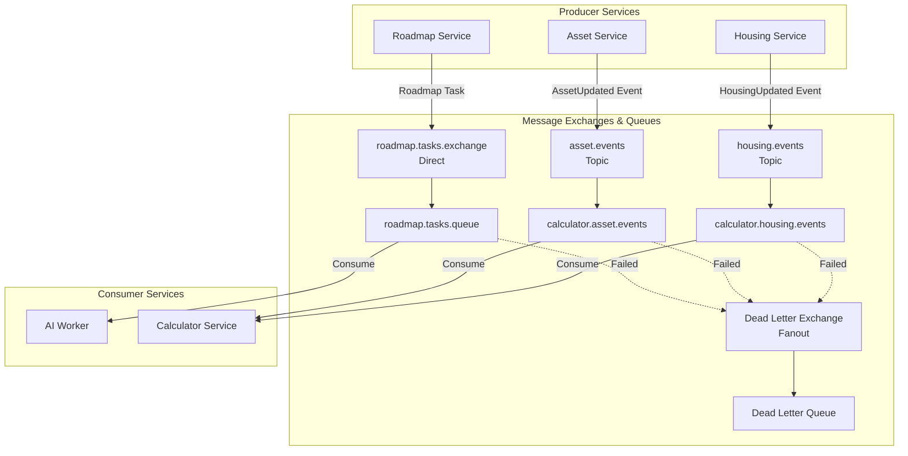

# 내집마련 도우미 Message Queue 설치계획서 - 개발환경

## 1. 개요

### 1.1 문서 목적
내집마련 도우미 서비스의 개발환경에서 비동기 메시징 시스템 구축을 위한 RabbitMQ 설치 계획 수립

### 1.2 적용 환경
- **대상 환경**: 개발환경 (Development)
- **Message Queue**: RabbitMQ 3.12+ (Helm Chart 배포)
- **용도**:
  - AI 로드맵 생성 비동기 처리
  - 데이터 변경 이벤트 전파 (캐시 무효화)

### 1.3 관련 문서
- 외부시퀀스설계서: `design/backend/sequence/outer/*.puml`
- 물리아키텍처: `design/backend/physical/physical-architecture-dev.md`
- 논리아키텍처: `design/backend/logical/logical-architecture.md`
- 백킹서비스설치방법: `claude/backing-service-method.md`

## 2. 요구사항 분석

### 2.1 비동기 통신 요구사항

#### 2.1.1 식별된 비동기 처리 플로우



#### 2.1.2 메시지 타입 및 특성

| 용도 | Exchange | Queue | 메시지 타입 | 처리 시간 | 우선순위 | TTL |
|------|----------|-------|-------------|-----------|----------|-----|
| AI 로드맵 생성 | roadmap.tasks.exchange | roadmap.tasks.queue | `{taskId, userId, finalHousingId}` | 30-60초 | 높음 | 5분 |
| 자산 변경 이벤트 | asset.events | calculator.asset.events | `{eventType, userId, assetId, updateType}` | < 100ms | 중간 | 없음 |
| 주택 변경 이벤트 | housing.events | calculator.housing.events | `{eventType, userId, housingId, updateType}` | < 100ms | 중간 | 없음 |

#### 2.1.3 서비스별 역할

**Producer Services**:
- **Roadmap Service**: AI 로드맵 생성 태스크 발행
- **Asset Service**: 자산 데이터 변경 이벤트 발행
- **Housing Service**: 주택 데이터 변경 이벤트 발행

**Consumer Services**:
- **AI Worker**: 로드맵 생성 태스크 처리 (LLM API 호출)
- **Calculator Service**: 데이터 변경 이벤트 수신 및 캐시 무효화

**이벤트 발행**:
- Roadmap 생성 완료: SSE를 통한 프론트엔드 알림
- 캐시 무효화 완료: 다음 계산 요청 시 자동 반영

### 2.2 성능 요구사항

#### 2.2.1 처리량 및 응답 시간
| 메트릭 | 로드맵 생성 | 이벤트 전파 |
|--------|-------------|-------------|
| **초기 응답 시간** | < 3초 (taskId 반환) | < 1초 (이벤트 발행) |
| **실제 처리 시간** | 30-60초 (비동기) | < 100ms (캐시 무효화) |
| **동시 처리량** | 10-20 태스크/분 | 1000 이벤트/초 |
| **큐 대기 깊이** | < 100 태스크 | < 1000 이벤트 |
| **워커 인스턴스** | 3-5개 (Auto Scaling) | N/A (동기 처리) |

#### 2.2.2 신뢰성 요구사항
- **메시지 손실률**: 0% (Durable Queue 사용)
- **메시지 순서**: 보장 불필요 (Eventual Consistency)
- **재시도 정책**: 3회 (Exponential Backoff: 5s, 15s, 30s)
- **DLQ 전환**: 3회 실패 후 Dead Letter Queue 이동

### 2.3 제약사항
- **비용 최적화**: 개발환경은 단일 노드로 운영 (운영환경은 HA 클러스터)
- **단순 구성**: 개발 효율성을 위한 복잡도 최소화
- **개발팀 규모**: 6명 개발자 + 2명 QA
- **Kubernetes 배포**: Helm Chart를 통한 표준 배포

## 3. RabbitMQ 설치 계획

### 3.1 RabbitMQ 구성

#### 3.1.1 RabbitMQ 설치 사양
```yaml
rabbitmq_configuration:
  version: 3.12.x
  deployment_type: Single Node (개발환경)
  namespace: home-starter-dev

  resource_limits:
    cpu: 1 core
    memory: 2Gi
    storage: 20Gi
    storage_class: standard  # Kubernetes 기본 StorageClass

  persistence:
    enabled: true
    volume_size: 20Gi

  management_ui:
    enabled: true
    port: 15672

  rabbitmq_port: 5672
```

#### 3.1.2 Exchange 설계
| Exchange 이름 | 타입 | Durable | 용도 | Routing Key |
|---------------|------|---------|------|-------------|
| roadmap.tasks.exchange | Direct | Yes | AI 로드맵 생성 태스크 | roadmap.task |
| asset.events | Topic | Yes | 자산 변경 이벤트 | asset.updated |
| housing.events | Topic | Yes | 주택 변경 이벤트 | housing.updated |
| roadmap.dlx | Fanout | Yes | 실패 태스크 처리 | - |
| events.dlx | Fanout | Yes | 실패 이벤트 처리 | - |

#### 3.1.3 Queue 설계
| Queue 이름 | Max Length | Message TTL | Max Retries | Dead Letter Exchange | 용도 |
|-----------|------------|-------------|-------------|----------------------|------|
| roadmap.tasks.queue | 1000 | 5분 | 3회 | roadmap.dlx | AI 로드맵 생성 태스크 |
| calculator.asset.events | 10000 | 없음 | 3회 | events.dlx | 자산 변경 이벤트 |
| calculator.housing.events | 10000 | 없음 | 3회 | events.dlx | 주택 변경 이벤트 |
| roadmap.dlq | 100 | 7일 | - | - | 실패한 로드맵 태스크 |
| events.dlq | 100 | 7일 | - | - | 실패한 이벤트 메시지 |

### 3.2 연결 설정

#### 3.2.1 연결 구성
```yaml
connection_configuration:
  authentication:
    type: Username/Password
    storage: Kubernetes Secret
    secret_name: rabbitmq-credentials
    default_user: admin

  connection_pool:
    size: 20  # 서비스당 연결 풀 크기
    channels_per_connection: 100

  retry_policy:
    type: Exponential Backoff
    max_attempts: 3
    intervals: [5s, 15s, 30s]

  timeout:
    connection: 30s
    channel: 60s
    operation: 30s
```

#### 3.2.2 서비스별 연결 정보
| 서비스 | 역할 | 접근 Exchange/Queue | 권한 |
|--------|------|---------------------|------|
| Roadmap Service | Producer | roadmap.tasks.exchange | Publish |
| Asset Service | Producer | asset.events | Publish |
| Housing Service | Producer | housing.events | Publish |
| AI Worker | Consumer | roadmap.tasks.queue | Consume, Ack/Nack |
| Calculator Service | Consumer | calculator.asset.events, calculator.housing.events | Consume, Ack/Nack |

### 3.3 보안 설정

#### 3.3.1 인증 및 권한
```yaml
security_configuration:
  authentication:
    method: Username/Password
    users:
      - username: admin
        password: ${RABBITMQ_ADMIN_PASSWORD}  # Kubernetes Secret
        tags: [administrator]

      - username: roadmap-publisher
        password: ${ROADMAP_PUBLISHER_PASSWORD}
        permissions:
          vhost: /
          configure: ""
          write: "roadmap\\..*"
          read: ""

      - username: event-publisher
        password: ${EVENT_PUBLISHER_PASSWORD}
        permissions:
          vhost: /
          configure: ""
          write: "(asset|housing)\\.events"
          read: ""

      - username: ai-worker
        password: ${AI_WORKER_PASSWORD}
        permissions:
          vhost: /
          configure: ""
          write: ""
          read: "roadmap\\..*"

      - username: calculator-consumer
        password: ${CALCULATOR_CONSUMER_PASSWORD}
        permissions:
          vhost: /
          configure: ""
          write: ""
          read: "calculator\\..*"

  secret_management:
    storage: Kubernetes Secrets
    rotation: Manual (개발환경)

  network_security:
    type: ClusterIP (Kubernetes 내부만 접근)
    management_ui: LoadBalancer (개발 편의성)
```

### 3.4 모니터링 설정

#### 3.4.1 기본 모니터링
```yaml
monitoring_configuration:
  metrics:
    enabled: true
    exporter: Prometheus
    port: 15692
    retention: 7일

  alerts:
    - name: queue-depth-warning
      condition: queue_messages_ready > 500
      severity: Warning

    - name: queue-depth-critical
      condition: queue_messages_ready > 1000
      severity: Critical

    - name: dlq-messages
      condition: dlq_messages > 10
      severity: Warning

    - name: consumer-down
      condition: queue_consumers == 0
      severity: Critical

  logging:
    level: info
    format: json
    output: stdout  # Kubernetes 로그 수집

  management_ui:
    enabled: true
    port: 15672
    access: LoadBalancer
```

## 4. Helm Chart 설치 절차

### 4.1 사전 준비사항
- [x] Kubernetes 클러스터 접근 권한
- [x] Helm 3.x 설치
- [x] kubectl 설치 및 클러스터 연결
- [x] StorageClass 확인 (기본 SC 사용)
- [x] Namespace 생성

### 4.2 Helm Chart 설치

#### 4.2.1 환경 변수 설정
```bash
#!/bin/bash
# 환경 변수 설정
export NAMESPACE="home-starter-dev"
export RELEASE_NAME="rabbitmq"
export CHART_VERSION="12.x.x"  # Bitnami RabbitMQ Chart

# RabbitMQ 설정
export RABBITMQ_USERNAME="admin"
export RABBITMQ_PASSWORD=$(openssl rand -base64 32)
export RABBITMQ_ERLANG_COOKIE=$(openssl rand -base64 32)

# 저장
echo "RABBITMQ_PASSWORD=${RABBITMQ_PASSWORD}" > .env.rabbitmq
echo "RABBITMQ_ERLANG_COOKIE=${RABBITMQ_ERLANG_COOKIE}" >> .env.rabbitmq
chmod 600 .env.rabbitmq
```

#### 4.2.2 Namespace 생성
```bash
# Namespace 생성
kubectl create namespace ${NAMESPACE}

# Secret 생성
kubectl create secret generic rabbitmq-credentials \
    --from-literal=rabbitmq-password="${RABBITMQ_PASSWORD}" \
    --from-literal=rabbitmq-erlang-cookie="${RABBITMQ_ERLANG_COOKIE}" \
    --namespace ${NAMESPACE}
```

#### 4.2.3 Helm Values 파일 생성
```yaml
# rabbitmq-values-dev.yaml
auth:
  username: admin
  existingPasswordSecret: rabbitmq-credentials
  existingSecretPasswordKey: rabbitmq-password
  existingErlangSecret: rabbitmq-credentials
  existingSecretErlangKey: rabbitmq-erlang-cookie

replicaCount: 1  # 개발환경: 단일 노드

persistence:
  enabled: true
  storageClass: ""  # 기본 StorageClass 사용
  size: 20Gi

resources:
  requests:
    cpu: 500m
    memory: 1Gi
  limits:
    cpu: 1000m
    memory: 2Gi

service:
  type: ClusterIP
  port: 5672
  managerPort: 15672

metrics:
  enabled: true
  serviceMonitor:
    enabled: false  # Prometheus Operator 미사용 시
  prometheusRule:
    enabled: false

extraPlugins: "rabbitmq_management rabbitmq_prometheus"

extraConfiguration: |
  # Dead Letter Exchange 설정
  default_vhost = /
  default_user = admin
  default_pass = CHANGE_ME

  # 성능 최적화
  vm_memory_high_watermark.relative = 0.6
  disk_free_limit.absolute = 5GB

  # 로깅
  log.console = true
  log.console.level = info
```

#### 4.2.4 Helm 설치 실행
```bash
# Helm Repository 추가
helm repo add bitnami https://charts.bitnami.com/bitnami
helm repo update

# RabbitMQ 설치
helm install ${RELEASE_NAME} bitnami/rabbitmq \
    --namespace ${NAMESPACE} \
    --version ${CHART_VERSION} \
    --values rabbitmq-values-dev.yaml \
    --wait

# 설치 확인
kubectl get pods -n ${NAMESPACE}
kubectl get svc -n ${NAMESPACE}
```

### 4.3 Exchange 및 Queue 초기화

#### 4.3.1 초기화 스크립트
```bash
#!/bin/bash
# init-rabbitmq-resources.sh

# RabbitMQ Pod 이름 가져오기
POD_NAME=$(kubectl get pods -n ${NAMESPACE} -l app.kubernetes.io/name=rabbitmq -o jsonpath='{.items[0].metadata.name}')

# Exchange 생성
kubectl exec -n ${NAMESPACE} ${POD_NAME} -- rabbitmqadmin declare exchange \
    name=roadmap.tasks.exchange type=direct durable=true

kubectl exec -n ${NAMESPACE} ${POD_NAME} -- rabbitmqadmin declare exchange \
    name=asset.events type=topic durable=true

kubectl exec -n ${NAMESPACE} ${POD_NAME} -- rabbitmqadmin declare exchange \
    name=housing.events type=topic durable=true

kubectl exec -n ${NAMESPACE} ${POD_NAME} -- rabbitmqadmin declare exchange \
    name=roadmap.dlx type=fanout durable=true

kubectl exec -n ${NAMESPACE} ${POD_NAME} -- rabbitmqadmin declare exchange \
    name=events.dlx type=fanout durable=true

# Dead Letter Queue 생성
kubectl exec -n ${NAMESPACE} ${POD_NAME} -- rabbitmqadmin declare queue \
    name=roadmap.dlq durable=true arguments='{"x-message-ttl": 604800000}'

kubectl exec -n ${NAMESPACE} ${POD_NAME} -- rabbitmqadmin declare queue \
    name=events.dlq durable=true arguments='{"x-message-ttl": 604800000}'

# Main Queue 생성 (DLX 설정 포함)
kubectl exec -n ${NAMESPACE} ${POD_NAME} -- rabbitmqadmin declare queue \
    name=roadmap.tasks.queue durable=true \
    arguments='{
        "x-max-length": 1000,
        "x-message-ttl": 300000,
        "x-dead-letter-exchange": "roadmap.dlx",
        "x-max-retries": 3
    }'

kubectl exec -n ${NAMESPACE} ${POD_NAME} -- rabbitmqadmin declare queue \
    name=calculator.asset.events durable=true \
    arguments='{
        "x-max-length": 10000,
        "x-dead-letter-exchange": "events.dlx",
        "x-max-retries": 3
    }'

kubectl exec -n ${NAMESPACE} ${POD_NAME} -- rabbitmqadmin declare queue \
    name=calculator.housing.events durable=true \
    arguments='{
        "x-max-length": 10000,
        "x-dead-letter-exchange": "events.dlx",
        "x-max-retries": 3
    }'

# Binding 생성
kubectl exec -n ${NAMESPACE} ${POD_NAME} -- rabbitmqadmin declare binding \
    source=roadmap.tasks.exchange destination=roadmap.tasks.queue \
    routing_key=roadmap.task

kubectl exec -n ${NAMESPACE} ${POD_NAME} -- rabbitmqadmin declare binding \
    source=asset.events destination=calculator.asset.events \
    routing_key=asset.updated

kubectl exec -n ${NAMESPACE} ${POD_NAME} -- rabbitmqadmin declare binding \
    source=housing.events destination=calculator.housing.events \
    routing_key=housing.updated

kubectl exec -n ${NAMESPACE} ${POD_NAME} -- rabbitmqadmin declare binding \
    source=roadmap.dlx destination=roadmap.dlq

kubectl exec -n ${NAMESPACE} ${POD_NAME} -- rabbitmqadmin declare binding \
    source=events.dlx destination=events.dlq

echo "RabbitMQ resources initialized successfully"
```

### 4.4 검증 절차

#### 4.4.1 설치 확인
```bash
# Pod 상태 확인
kubectl get pods -n ${NAMESPACE} -l app.kubernetes.io/name=rabbitmq

# Service 확인
kubectl get svc -n ${NAMESPACE}

# Logs 확인
kubectl logs -n ${NAMESPACE} -l app.kubernetes.io/name=rabbitmq --tail=50

# RabbitMQ 상태 확인
kubectl exec -n ${NAMESPACE} ${POD_NAME} -- rabbitmq-diagnostics status
```

#### 4.4.2 연결 테스트
```bash
# Management UI 접근 (Port Forward)
kubectl port-forward -n ${NAMESPACE} svc/rabbitmq 15672:15672

# 브라우저에서 http://localhost:15672 접속
# Username: admin, Password: (생성된 패스워드)

# Exchange 및 Queue 확인
kubectl exec -n ${NAMESPACE} ${POD_NAME} -- rabbitmqadmin list exchanges
kubectl exec -n ${NAMESPACE} ${POD_NAME} -- rabbitmqadmin list queues
```

#### 4.4.3 메시지 송수신 테스트
```python
# test_rabbitmq_connection.py
import pika
import json
import os

# RabbitMQ 연결 정보 (Kubernetes Service 내부)
rabbitmq_host = "rabbitmq.home-starter-dev.svc.cluster.local"
rabbitmq_port = 5672
rabbitmq_user = "admin"
rabbitmq_password = os.environ.get('RABBITMQ_PASSWORD')

# 연결 생성
credentials = pika.PlainCredentials(rabbitmq_user, rabbitmq_password)
parameters = pika.ConnectionParameters(
    host=rabbitmq_host,
    port=rabbitmq_port,
    credentials=credentials,
    heartbeat=30,
    connection_attempts=3
)

connection = pika.BlockingConnection(parameters)
channel = connection.channel()

# 테스트 메시지 발행
exchange_name = "roadmap.tasks.exchange"
routing_key = "roadmap.task"
test_message = {
    "taskId": "test-task-123",
    "userId": "user-456",
    "finalHousingId": "housing-789"
}

channel.basic_publish(
    exchange=exchange_name,
    routing_key=routing_key,
    body=json.dumps(test_message),
    properties=pika.BasicProperties(
        delivery_mode=2,  # Persistent
        content_type='application/json'
    )
)
print(f"Published test message to {exchange_name}")

# 메시지 수신 테스트
queue_name = "roadmap.tasks.queue"

def callback(ch, method, properties, body):
    print(f"Received message: {body.decode()}")
    ch.basic_ack(delivery_tag=method.delivery_tag)

channel.basic_consume(
    queue=queue_name,
    on_message_callback=callback,
    auto_ack=False
)

print(f"Waiting for messages from {queue_name}. Press CTRL+C to exit.")
try:
    channel.start_consuming()
except KeyboardInterrupt:
    channel.stop_consuming()

connection.close()
print("Connection closed")
```

## 5. 운영 가이드

### 5.1 일상 운영

#### 5.1.1 모니터링 체크리스트
- [ ] **큐 깊이 확인** (일 2회)
  - roadmap.tasks.queue < 100
  - calculator.asset.events < 1000
  - calculator.housing.events < 1000
- [ ] **Dead Letter Queue 확인** (일 1회)
  - roadmap.dlq messages = 0
  - events.dlq messages = 0
- [ ] **Consumer 상태 확인** (일 1회)
  - AI Worker 인스턴스 개수: 3-5개
  - Calculator Service 연결 상태: Active
- [ ] **디스크 사용률 확인** (주 1회)
  - Persistence Volume < 80%

#### 5.1.2 문제 해결 가이드
| 증상 | 원인 | 해결 방법 |
|------|------|-----------|
| 큐 깊이 급증 (> 500) | Consumer 처리 지연 | AI Worker 인스턴스 증가 (HPA) |
| DLQ 메시지 증가 | 메시지 처리 실패 | 로그 분석 → 코드 수정 → 재처리 |
| 연결 실패 | RabbitMQ Pod 재시작 | Pod 로그 확인, 필요 시 재배포 |
| 메모리 부족 | 큐에 메시지 과다 누적 | 큐 정리 또는 리소스 증설 |
| Disk Full | Persistence Volume 부족 | PVC 확장 (20Gi → 50Gi) |

### 5.2 백업 및 복구

#### 5.2.1 백업 전략
```yaml
backup_strategy:
  configuration:
    method: Export definitions (Exchange, Queue, Binding)
    schedule: Weekly
    storage: Git Repository (IaC)

  data:
    method: PersistentVolume Snapshot
    schedule: Daily
    retention: 7일

  secrets:
    method: Sealed Secrets (Bitnami Sealed Secrets)
    storage: Git Repository (encrypted)
```

#### 5.2.2 백업 스크립트
```bash
#!/bin/bash
# backup-rabbitmq.sh

POD_NAME=$(kubectl get pods -n ${NAMESPACE} -l app.kubernetes.io/name=rabbitmq -o jsonpath='{.items[0].metadata.name}')

# Definitions 백업
kubectl exec -n ${NAMESPACE} ${POD_NAME} -- rabbitmqadmin export backup/rabbitmq-definitions.json

# PVC 스냅샷 (Kubernetes CSI Snapshot)
kubectl create -f - <<EOF
apiVersion: snapshot.storage.k8s.io/v1
kind: VolumeSnapshot
metadata:
  name: rabbitmq-snapshot-$(date +%Y%m%d)
  namespace: ${NAMESPACE}
spec:
  volumeSnapshotClassName: csi-snapclass
  source:
    persistentVolumeClaimName: data-rabbitmq-0
EOF

echo "Backup completed: $(date)"
```

#### 5.2.3 복구 절차
```bash
#!/bin/bash
# restore-rabbitmq.sh

# 1. Helm 재설치 (기존 데이터 보존)
helm upgrade ${RELEASE_NAME} bitnami/rabbitmq \
    --namespace ${NAMESPACE} \
    --values rabbitmq-values-dev.yaml \
    --reuse-values

# 2. Definitions 복구
POD_NAME=$(kubectl get pods -n ${NAMESPACE} -l app.kubernetes.io/name=rabbitmq -o jsonpath='{.items[0].metadata.name}')
kubectl cp backup/rabbitmq-definitions.json ${NAMESPACE}/${POD_NAME}:/tmp/
kubectl exec -n ${NAMESPACE} ${POD_NAME} -- rabbitmqadmin import /tmp/rabbitmq-definitions.json

# 3. 서비스 재시작
kubectl rollout restart statefulset rabbitmq -n ${NAMESPACE}

echo "Restore completed: $(date)"
```

## 6. 비용 분석

### 6.1 Kubernetes 리소스 비용 (개발환경)
| 항목 | 사양 | 월간 비용 (예상) |
|------|------|------------------|
| CPU | 1 core | ~$30 |
| Memory | 2Gi | ~$10 |
| Storage (PV) | 20Gi | ~$5 |
| LoadBalancer (Management UI) | 1개 | ~$20 |
| **총 비용** | | **~$65/월** |

### 6.2 비용 최적화 방안
- **개발 시간 외 Scale Down**: 야간/주말 RabbitMQ Pod 중지 (50% 절감)
- **Management UI LoadBalancer 제거**: Port Forward 사용 (월 $20 절감)
- **Storage 최적화**: Message TTL 설정으로 디스크 사용량 최소화
- **운영환경 전환 시**: HA 클러스터 (3 nodes) 구성으로 가용성 확보

## 7. 운영환경 마이그레이션 고려사항

### 7.1 운영환경 전환 시 변경사항
```yaml
production_changes:
  high_availability:
    replicaCount: 3  # 3-node cluster
    podAntiAffinity: true  # 다른 노드에 배포

  resources:
    requests:
      cpu: 1000m
      memory: 2Gi
    limits:
      cpu: 2000m
      memory: 4Gi

  persistence:
    size: 100Gi  # 5년치 데이터
    storageClass: "ssd"  # 고성능 스토리지

  monitoring:
    prometheus: true
    grafana_dashboards: true
    alertmanager: true

  security:
    tls_enabled: true
    mtls_enabled: true  # Service Mesh 연동
    network_policy: true

  backup:
    schedule: "0 2 * * *"  # 매일 02:00
    retention: 30일
```

### 7.2 확장 계획
- **Message Throughput**: 1000 events/sec → 10,000 events/sec (10배)
- **Storage**: 20Gi → 100Gi (5배)
- **HA**: Single Node → 3-node Cluster
- **Monitoring**: Basic → Prometheus + Grafana + Alerting
- **Security**: Username/Password → mTLS + Service Mesh

## 8. 체크리스트

### 8.1 설치 전 체크리스트
- [x] Kubernetes 클러스터 접근 권한 확인
- [x] Helm 3.x 설치 확인
- [x] Namespace 생성 (home-starter-dev)
- [x] StorageClass 확인 (기본 SC 사용)
- [ ] 관리자 패스워드 생성 및 보안 저장
- [ ] Bitnami RabbitMQ Chart 버전 확인

### 8.2 설치 후 체크리스트
- [ ] RabbitMQ Pod Running 상태 확인
- [ ] Service 생성 확인 (ClusterIP: 5672, Management: 15672)
- [ ] PersistentVolumeClaim Bound 확인
- [ ] Exchange 5개 생성 확인
- [ ] Queue 5개 생성 확인
- [ ] Binding 설정 확인
- [ ] 메시지 송수신 테스트 성공
- [ ] Management UI 접근 확인
- [ ] Prometheus Metrics 활성화 확인
- [ ] 초기화 스크립트 실행 완료

### 8.3 통합 테스트 체크리스트
- [ ] Roadmap Service → RabbitMQ 연결 성공
- [ ] AI Worker → RabbitMQ 연결 및 메시지 수신 성공
- [ ] Asset Service → 이벤트 발행 성공
- [ ] Calculator Service → 이벤트 수신 및 캐시 무효화 성공
- [ ] Dead Letter Queue 동작 확인 (의도적 실패 테스트)
- [ ] 재시도 정책 동작 확인 (3회 재시도)

## 9. 참고사항

### 9.1 개발환경 제한사항
- **Single Node**: HA 미지원 (Pod 재시작 시 짧은 다운타임 발생 가능)
- **LoadBalancer**: Management UI만 외부 접속 가능
- **Monitoring**: 기본 Prometheus Metrics만 제공
- **Backup**: 수동 백업 (자동화 미지원)

### 9.2 모범 사례
- **Idempotency**: 메시지 처리 시 taskId/eventId 기반 중복 처리 방지
- **Exponential Backoff**: 3회 재시도 (5s, 15s, 30s)
- **Dead Letter Queue 모니터링**: DLQ 메시지는 즉시 조사 및 처리
- **Message Size 최적화**: 평균 32KB, 최대 64KB (큰 데이터는 S3 참조)
- **Batch Processing**: 가능한 경우 배치로 처리하여 성능 최적화

### 9.3 트러블슈팅 가이드

#### 연결 실패 시
```bash
# RabbitMQ Pod 로그 확인
kubectl logs -n ${NAMESPACE} -l app.kubernetes.io/name=rabbitmq --tail=100

# Service 엔드포인트 확인
kubectl get endpoints -n ${NAMESPACE} rabbitmq

# DNS 해결 확인
kubectl run -it --rm debug --image=busybox --restart=Never -- nslookup rabbitmq.home-starter-dev.svc.cluster.local
```

#### 큐 깊이 급증 시
```bash
# 큐 상태 확인
kubectl exec -n ${NAMESPACE} ${POD_NAME} -- rabbitmqadmin list queues name messages consumers

# Consumer 연결 확인
kubectl exec -n ${NAMESPACE} ${POD_NAME} -- rabbitmqadmin list consumers

# AI Worker HPA 확인 및 수동 스케일
kubectl get hpa -n ${NAMESPACE}
kubectl scale deployment ai-worker -n ${NAMESPACE} --replicas=5
```

#### Dead Letter Queue 메시지 확인
```bash
# DLQ 메시지 조회
kubectl exec -n ${NAMESPACE} ${POD_NAME} -- rabbitmqadmin get queue=roadmap.dlq count=10

# 메시지 재처리 (수동)
# 1. DLQ 메시지 내용 확인 및 원인 분석
# 2. 코드 수정 후 재배포
# 3. DLQ에서 메시지 수동 이동 또는 재발행
```

## 10. 승인 및 이력

### 10.1 문서 승인
- **작성자**: 송주영(주영) / DevOps Engineer
- **검토자**: 홍길동(길동) / Architect
- **승인자**: 김민준(민준) / Product Owner
- **작성일**: 2025-12-29

### 10.2 변경 이력
| 버전 | 날짜 | 변경 내용 | 작성자 |
|------|------|-----------|--------|
| 1.0 | 2025-12-29 | 최초 작성 (개발환경 RabbitMQ 설치 계획) | 송주영 |

---

## 부록 A: RabbitMQ 아키텍처 참조

### A.1 Message Flow 다이어그램
```
[Roadmap Service]
    → Publish (roadmap.task)
    → [roadmap.tasks.exchange (Direct)]
    → [roadmap.tasks.queue]
    → Consume
    → [AI Worker Instances (3-5)]
    → Process (30-60s)
    → Ack/Nack
    → (if Nack x3) → [roadmap.dlx] → [roadmap.dlq]

[Asset Service]
    → Publish (asset.updated)
    → [asset.events (Topic)]
    → [calculator.asset.events]
    → Consume
    → [Calculator Service]
    → Invalidate Cache
    → Ack

[Housing Service]
    → Publish (housing.updated)
    → [housing.events (Topic)]
    → [calculator.housing.events]
    → Consume
    → [Calculator Service]
    → Invalidate Cache
    → Ack
```

### A.2 Retry & DLQ 처리 흐름
```
Message Published
    ↓
Queue Delivery (Attempt 1)
    ↓
Consumer Processing
    ↓
[Success?]
    ├─ Yes → Ack → Message Deleted
    └─ No → Nack → Requeue (Wait 5s)
        ↓
    Queue Delivery (Attempt 2)
        ↓
    [Success?]
        ├─ Yes → Ack → Message Deleted
        └─ No → Nack → Requeue (Wait 15s)
            ↓
        Queue Delivery (Attempt 3)
            ↓
        [Success?]
            ├─ Yes → Ack → Message Deleted
            └─ No → Nack → DLX → DLQ
                ↓
            Manual Investigation & Reprocessing
```

---

**문서 끝**
